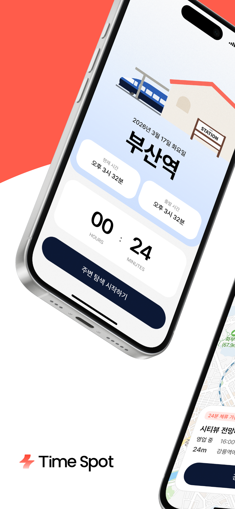
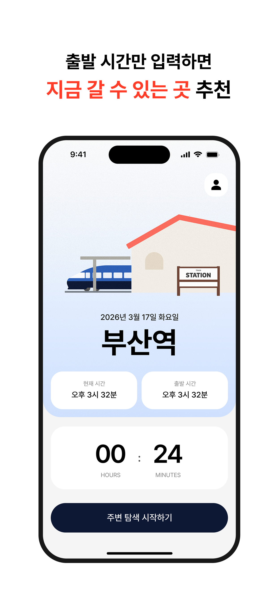
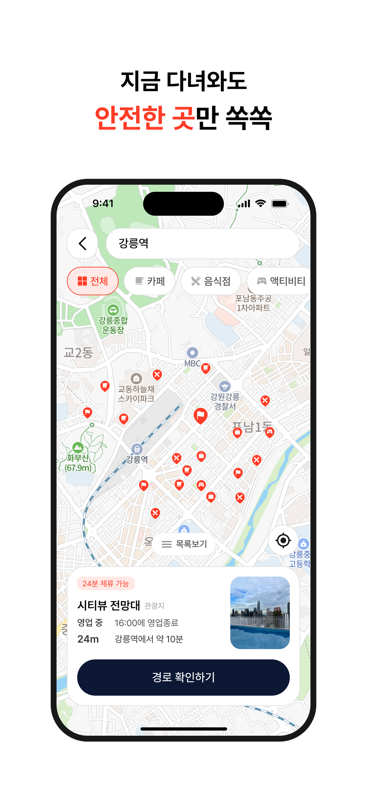
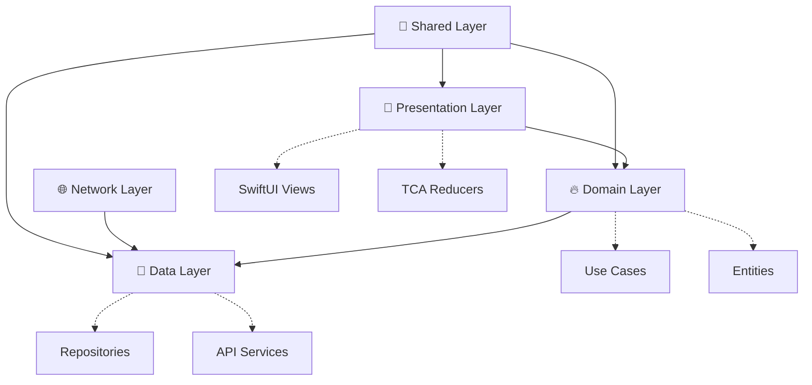

# TimeSpot iOS

<div align="center">


**여행의 새로운 시작, 대기 시간을 활용한 스마트한 여정**


[📱 App Store](#) | [🎯 Features](#-주요-기능) | [🏗 Architecture](#-프로젝트-아키텍처) | [🚀 Quick Start](#-빠른-시작)

---

</div>

## 📖 프로젝트 소개

**TimeSpot**은 KTX 출발 전 대기 시간을 효율적으로 활용할 수 있도록 도와주는 iOS 애플리케이션입니다.
역 주변의 관광지, 맛집, 카페 등을 탐색하고 출발 시간에 맞춰 안전하게 플랫폼으로 돌아올 수 있도록 가이드합니다.

> 💡 **우리는 왜 이 앱을 만들었을까요?**
> 기차를 기다리는 시간, 그저 대기실에서 시간을 보내기엔 아깝지 않나요?
> TimeSpot과 함께 여행의 시작부터 특별한 경험을 만들어보세요.

### 📱 스크린샷

<div align="center">

| 메인 화면 | 역 선택 | 주변 탐색 | 경로 안내 |
|:---:|:---:|:---:|:---:|
|  |  |  |  |


</div>

## ✨ 주요 기능

### 🚉 스마트한 여행 계획
- **전국 주요 KTX역 지원**: 서울, 부산, 대전, 광주 등 전국 26개 역
- **정확한 출발 시간 관리**: 다음날 23:59까지 자유로운 시간 설정
- **대기 시간 계산**: 최소 20분 이상의 여유 시간 확보

### 🗺️ 주변 장소 탐색
- **다양한 POI 정보**: 관광지, 맛집, 카페, 쇼핑, 문화시설 등
- **실시간 위치 기반**: GPS를 활용한 정확한 주변 정보
- **상세 정보 제공**: 영업시간, 리뷰, 연락처 등

### 📍 똑똑한 길찾기
- **NaverMap 연동**: 정확하고 빠른 경로 안내
- **외부 앱 지원**: 네이버맵, 구글맵, 애플 지도 등
- **실시간 소요 시간**: 도보 경로 및 예상 도착 시간

### ⏰ 알림 시스템
- **15분 전**: "활동을 차분히 마무리해 주세요"
- **10분 전**: "슬슬 일어날 준비를 해볼까요?"
- **5분 전**: "출발 채비를 할 시간이에요"
- **즉시 출발**: "지금 바로 출발해야 해요!"

### 📊 여행 기록 관리
- **방문 히스토리**: 다녀온 장소와 여행 기록 보관
- **여정 추적**: 출발부터 복귀까지의 전체 여정 관리

## 🏗 프로젝트 아키텍처

### 🎯 Micro Feature Architecture with Tuist

```
TimeSpot-iOS/
├── 📱 Projects/
│   ├── App/                     # 메인 애플리케이션 타겟
│   │   └── Sources/
│   │       ├── Application/    # AppDelegate, SceneDelegate
│   │       └── Root/          # 루트 화면 설정
│   │
│   ├── Presentation/            # 🎨 UI Layer
│   │   └── Home/               # 홈 기능 모듈
│   │       ├── Sources/
│   │       │   ├── Main/       # 메인 홈 화면
│   │       │   ├── TrainStation/ # 역 선택
│   │       │   ├── Explore/    # 주변 탐색
│   │       │   ├── Route/      # 경로 안내
│   │       │   ├── RouteNotification/ # 알림
│   │       │   └── Components/ # 공통 컴포넌트
│   │       ├── Tests/          # 단위 테스트
│   │       └── Testing/        # 테스트 Mock
│   │
│   ├── Domain/                  # 🔥 Business Logic Layer
│   │   ├── Entity/             # 도메인 엔티티
│   │   ├── UseCase/            # 비즈니스 로직 구현
│   │   └── DomainInterface/    # 인터페이스 정의 (Protocol)
│   │
│   ├── Data/                   # 📡 Data Layer
│   │   ├── Service/            # REST API 서비스
│   │   ├── Repository/         # Repository 구현체
│   │   └── Model/              # DTO, Response Models
│   │
│   ├── Network/                # 🌐 Network Layer
│   │   ├── Networks/           # 네트워크 설정
│   │   ├── Foundations/        # 네트워크 유틸리티
│   │   └── ThirdPartys/        # AsyncMoya, WeaveDI
│   │
│   └── Shared/                 # 🔧 Shared Layer
│       ├── DesignSystem/       # 디자인 시스템
│       ├── Utill/              # 공통 유틸리티
│       └── ThirdPartyLib/      # 외부 라이브러리 래핑
│
└── 🔧 Tuist/                   # 프로젝트 설정
    ├── Package.swift
    └── ProjectDescriptionHelpers/
```

### 🏛️ Clean Architecture Pattern



### 📊 의존성 그래프 (Tuist Graph)

<div align="center">


*프로젝트 모듈 간 의존성 관계도 (자동 생성)*

</div>

### 🔄 의존성 방향 원칙

```
Presentation → Domain (UseCase Protocol)
       ↓
Domain/UseCase → Domain (Repository Protocol)
       ↓
Data/Repository → Domain (Entity + Repository Protocol)
       ↓
Data/Model → Domain (Entity 변환)
```

**핵심 설계 원칙:**
- ✅ **Presentation**은 Domain의 UseCase Protocol만 의존
- ✅ **Domain**은 외부 계층에 의존하지 않는 순수 비즈니스 로직
- ✅ **Data**는 Domain의 Entity와 Repository Protocol을 구현
- ✅ 모든 데이터 흐름은 **Domain을 중심**으로 진행

## 🛠 기술 스택

### Core Technologies
- **🎯 Architecture**: The Composable Architecture (TCA)
- **📦 Modularization**: Tuist 4.97.2 (Micro Feature Architecture)
- **💉 Dependency Injection**: WeaveDI
- **🔀 Navigation**: TCA Navigation
- **⚡ Concurrency**: Swift Concurrency (Actor 기반 비동기 처리)

### Key Dependencies
- **ComposableArchitecture**: 상태 관리 및 단방향 데이터 플로우
- **TCACoordinators**: TCA 기반 네비게이션 시스템
- **WeaveDI**: 의존성 주입 컨테이너
- **Swift Concurrency**: Actor 기반 Thread-Safe 비동기 처리

### UI & UX
- **🎨 UI Framework**: SwiftUI
- **🎨 Design System**: 커스텀 DesignSystem 모듈
- **🖼️ Image Loading**: Kingfisher with 최적화

### Networking & Data
- **🌐 HTTP Client**: Moya + AsyncMoya
- **📱 API Architecture**: RESTful API with JSON
- **💾 Local Storage**: UserDefaults, Keychain (Actor 기반)
- **📡 Real-time**: Push Notifications (APNs)

### Maps & Location
- **🗺️ Map Service**: Naver Maps SDK
- **📍 Location**: Core Location Framework
- **🛣️ Places**: Google Places API

### Development Tools
- **📊 Analytics**: 커스텀 로깅 시스템 (LogMacro)
- **🔧 Build Tool**: Tuist + SPM
- **🧪 Testing**: SwiftTesting + TCA Testing
- **📱 Automation**: fastlane (스크린샷, 배포)
- **⚡ Performance**: Swift Concurrency (async/await, Actor)

## 🚀 빠른 시작

### ✅ 필수 요구사항

- **💻 Xcode**: 16.0 이상
- **📱 iOS**: 17.0 이상
- **⚡ Swift**: 6.0 이상
- **🔧 Tuist**: 4.97.2 이상

### 🛠 설치 및 실행

#### 1️⃣ 저장소 클론
```bash
git clone https://github.com/Roy-wonji/TimeSpot-iOS.git
cd TimeSpot-iOS
```

#### 2️⃣ Tuist 설치
```bash
curl -Ls https://install.tuist.io | bash
```

#### 3️⃣ 프로젝트 빌드 및 생성
```bash
# 전체 워크플로우 (권장)
./make build      # clean → install → generate

# 또는 단계별 실행
./make clean      # 기존 파일 정리
./make install    # 의존성 설치
./make generate   # 프로젝트 생성
```

#### 4️⃣ Xcode에서 실행
```bash
open TimeSpot.xcworkspace
```

### ⚙️ 환경 설정

프로젝트 실행을 위해 다음 API 키가 필요합니다:

```swift
// Config.swift에서 설정
enum APIKeys {
    static let naverMapsClientID = "YOUR_NAVER_MAPS_KEY"
    static let googlePlacesAPI = "YOUR_GOOGLE_PLACES_KEY"
    static let timeSpotServerURL = "YOUR_SERVER_URL"
}
```

## 🛠️ 주요 명령어

### 🔄 기본 워크플로우
```bash
./make build      # 전체 빌드 프로세스 (권장)
./make generate   # 프로젝트 생성만
./make moduleinit # 새 모듈 생성 (대화형)
```

### 🚨 문제 해결
```bash
./make reset      # 강력한 클린 + 캐시 삭제 + 재생성
./make clean      # 빌드 아티팩트 정리
./make install    # 의존성 재설치
```

### 🔍 코드 품질 관리
```bash
./make inspect-imports    # 모듈 의존성 검사
./make inspect-coverage   # 코드 커버리지 분석
./make graph             # 의존성 그래프 생성
```

### 📦 모듈 관리
```bash
./make moduleinit        # 새 Feature 모듈 생성
./make test             # 전체 테스트 실행
```

### 📱 스크린샷 자동 생성 (fastlane)
```bash
fastlane snapshot        # 전체 스크린샷 생성
fastlane snapshot --scheme TimeSpot  # 특정 스킴만
```

## 📋 사용법

### 1️⃣ 여행 계획 설정
1. **출발역 선택**: 전국 26개 주요 KTX역 중 선택
2. **출발 시간 설정**: 현재 시각부터 다음날 23:59까지
3. **대기 시간 확인**: 최소 20분 이상의 여유 시간 필요

### 2️⃣ 주변 장소 탐색
1. **"주변 탐색 시작하기"** 버튼 터치
2. **위치 권한** 허용 (정확한 주변 정보 제공을 위해 필요)
3. **카테고리별 탐색**: 관광지 🏛️, 맛집 🍴, 카페 ☕, 쇼핑 🛍️ 등

### 3️⃣ 스마트한 경로 안내
1. **장소 선택**: 방문하고 싶은 장소를 선택
2. **"길찾기 시작"**: 버튼을 터치하여 여정 시작
3. **외부 앱 연동**: 선호하는 지도 앱으로 실제 네비게이션

### 4️⃣ 안전한 복귀 가이드
- **📱 스마트 알림**: 출발 시간에 맞춰 단계별 알림
- **⏰ 실시간 추적**: 현재 위치에서 역까지의 실시간 경로
- **🔔 맞춤 알림**: 개인 일정에 맞춘 최적의 출발 타이밍


## 📄 라이선스

이 프로젝트는 **MIT 라이선스** 하에 배포됩니다.
자세한 내용은 [LICENSE](LICENSE) 파일을 참고하세요.

## 👥 팀 & 크레딧

### 💻 개발팀
- **iOS Developer & Architecture**: 서원지 ([@Roy-wonji](https://github.com/Roy-wonji))
- **Backend Developer**: [@loadingKKamo21](https://github.com/loadingKKamo21)
- **Designer**: 박미란
- **Product Manager**: 전희정


## 📞 문의 및 지원

- 📧 **이메일**: suhwj81@gmail.com
- 🐛 **버그 신고**: [Issues](https://github.com/Roy-wonji/TimeSpot-iOS/issues)
- 💡 **기능 제안**: [Discussions](https://github.com/Roy-wonji/TimeSpot-iOS/discussions)
- 📱 **App Store**: [TimeSpot 다운로드](#)

---

<div align="center">

**Made with ❤️ by SWYP Team**

*여행의 시작을 특별하게, TimeSpot과 함께하세요*

[](https://github.com/Roy-wonji/TimeSpot-iOS)

</div>

