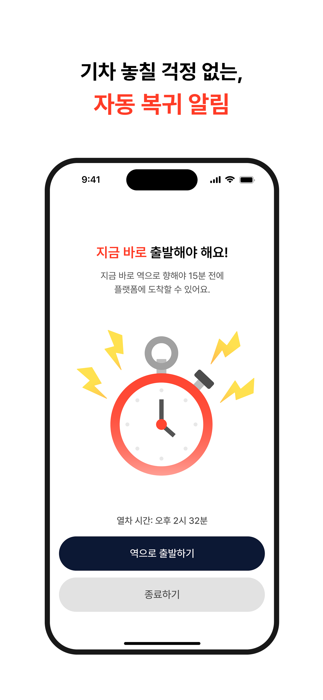
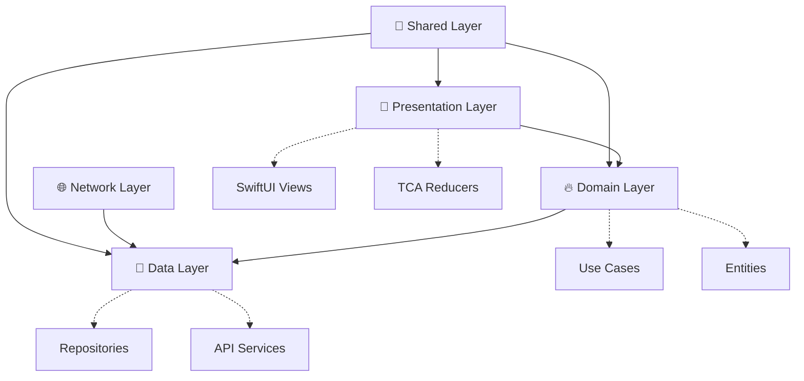

# TimeSpot iOS

<div align="center">


**여행의 새로운 시작, 대기 시간을 활용한 스마트한 여정**


[📱 App Store](#) | [🎯 Features](#-주요-기능) | [🏗 Architecture](#-프로젝트-아키텍처) | [🚀 Quick Start](#-빠른-시작)

---

</div>

## 📖 프로젝트 소개

**TimeSpot**은 KTX 출발 전 대기 시간을 효율적으로 활용할 수 있도록 도와주는 iOS 애플리케이션입니다.
역 주변의 관광지, 맛집, 카페 등을 탐색하고 출발 시간에 맞춰 안전하게 플랫폼으로 돌아올 수 있도록 가이드합니다.

> 💡 **우리는 왜 이 앱을 만들었을까요?**
> 기차를 기다리는 시간, 그저 대기실에서 시간을 보내기엔 아깝지 않나요?
> TimeSpot과 함께 여행의 시작부터 특별한 경험을 만들어보세요.

### 📱 스크린샷

<div align="center">

| 메인 화면 | 역 선택 | 주변 탐색 |
|:---:|:---:|:---:|
|  |  |  |

| 장소 상세 | 복귀 알림 |
|:---:|:---:|
|  |  |

</div>

## ✨ 주요 기능

### 🚉 스마트한 여행 계획
- **전국 주요 KTX역 지원**: 서울, 부산, 대전, 광주 등 전국 26개 역
- **정확한 출발 시간 관리**: 다음날 23:59까지 자유로운 시간 설정
- **대기 시간 계산**: 최소 20분 이상의 여유 시간 확보

### 🗺️ 주변 장소 탐색
- **다양한 POI 정보**: 관광지, 맛집, 카페, 쇼핑, 문화시설 등
- **실시간 위치 기반**: GPS를 활용한 정확한 주변 정보
- **상세 정보 제공**: 영업시간, 리뷰, 연락처 등

### 📍 똑똑한 길찾기
- **NaverMap 연동**: 정확하고 빠른 경로 안내
- **외부 앱 지원**: 네이버맵, 구글맵, 애플 지도 등 선택 가능
- **실시간 소요 시간**: 도보 경로 및 예상 도착 시간 계산
- **체류 시간 계산**: 왕복 도보 시간 + 플랫폼 대기 시간을 고려한 안전한 체류 시간 제공
- **원터치 길찾기**: 장소 선택 후 바로 외부 지도 앱으로 연결

### ⏰ 알림 시스템
- **15분 전**: "활동을 차분히 마무리해 주세요"
- **10분 전**: "슬슬 일어날 준비를 해볼까요?"
- **5분 전**: "출발 채비를 할 시간이에요"
- **즉시 출발**: "지금 바로 출발해야 해요!"

### 📊 여행 기록 관리
- **방문 히스토리**: 다녀온 장소와 여행 기록 보관
- **여정 추적**: 출발부터 복귀까지의 전체 여정 관리

## 🏗 프로젝트 아키텍처

### 🎯 Micro Feature Architecture with Tuist

```
TimeSpot-iOS/
├── 📱 Projects/
│   ├── App/                     # 메인 애플리케이션 타겟
│   │   └── Sources/
│   │       ├── Application/    # AppDelegate, SceneDelegate
│   │       └── Root/          # 루트 화면 설정
│   │
│   ├── Presentation/            # 🎨 UI Layer
│   │   └── Home/               # 홈 기능 모듈
│   │       ├── Sources/
│   │       │   ├── Main/       # 메인 홈 화면
│   │       │   ├── TrainStation/ # 역 선택
│   │       │   ├── Explore/    # 주변 탐색
│   │       │   ├── Route/      # 경로 안내
│   │       │   ├── RouteNotification/ # 알림
│   │       │   └── Components/ # 공통 컴포넌트
│   │       ├── Tests/          # 단위 테스트
│   │       └── Testing/        # 테스트 Mock
│   │
│   ├── Domain/                  # 🔥 Business Logic Layer
│   │   ├── Entity/             # 도메인 엔티티
│   │   ├── UseCase/            # 비즈니스 로직 구현
│   │   └── DomainInterface/    # 인터페이스 정의 (Protocol)
│   │
│   ├── Data/                   # 📡 Data Layer
│   │   ├── Service/            # REST API 서비스
│   │   ├── Repository/         # Repository 구현체
│   │   └── Model/              # DTO, Response Models
│   │
│   ├── Network/                # 🌐 Network Layer
│   │   ├── Networks/           # 네트워크 설정
│   │   ├── Foundations/        # 네트워크 유틸리티
│   │   └── ThirdPartys/        # AsyncMoya, WeaveDI
│   │
│   └── Shared/                 # 🔧 Shared Layer
│       ├── DesignSystem/       # 디자인 시스템
│       ├── Utill/              # 공통 유틸리티
│       └── ThirdPartyLib/      # 외부 라이브러리 래핑
│
├── 🔧 Tuist/                   # 프로젝트 설정
│   ├── Package.swift
│   └── ProjectDescriptionHelpers/
│
└── 🤖 agent/                   # 커스텀 Claude 에이전트
    └── ios-performance-optimizer.md
```

### 🏛️ Clean Architecture Pattern



### 📊 의존성 그래프 (Tuist Graph)

<div align="center">


</div>

*프로젝트 모듈 간 의존성 관계도 (자동 생성)*

### 🔄 의존성 방향 원칙

```
Presentation → Domain (UseCase Protocol)
       ↓
Domain/UseCase → Domain (Repository Protocol)
       ↓
Data/Repository → Domain (Entity + Repository Protocol)
       ↓
Data/Model → Domain (Entity 변환)
```

**핵심 설계 원칙:**
- ✅ **Presentation**은 Domain의 UseCase Protocol만 의존
- ✅ **Domain**은 외부 계층에 의존하지 않는 순수 비즈니스 로직
- ✅ **Data**는 Domain의 Entity와 Repository Protocol을 구현
- ✅ 모든 데이터 흐름은 **Domain을 중심**으로 진행

## 🛠 기술 스택

### Core Technologies
- **🎯 Architecture**: The Composable Architecture (TCA) 1.25.5
- **📦 Modularization**: Tuist 4.97.2 (Micro Feature Architecture)
- **💉 Dependency Injection**: WeaveDI 3.4.0
- **🔀 Navigation**: TCAFlow 1.1.0 (커스텀 라이브러리)
- **⚡ Concurrency**: Swift Concurrency (async/await)

### 📚 주요 라이브러리

#### 🎯 아키텍처 & 상태 관리
- **[ComposableArchitecture](https://github.com/pointfreeco/swift-composable-architecture)** 1.25.5 - 단방향 데이터 플로우 및 상태 관리
- **[swift-dependencies](https://github.com/pointfreeco/swift-dependencies)** 1.6.0 - 의존성 관리 시스템
- **[TCAFlow](https://github.com/Roy-wonji/TCAFlow.git)** 1.1.0 ⭐️ - TCA 기반 화면 전환 및 네비게이션 (커스텀)
- **[WeaveDI](https://github.com/Roy-wonji/WeaveDI.git)** 3.4.0 ⭐️ - 의존성 주입 컨테이너 (커스텀 포크)

#### 🔐 인증 & 보안
- **[GoogleSignIn-iOS](https://github.com/google/GoogleSignIn-iOS)** 9.0.0 - Google OAuth 2.0 인증
- **[AppAuth-iOS](https://github.com/openid/AppAuth-iOS.git)** 2.0.0 - OAuth 2.0 및 OpenID Connect 클라이언트

#### 🌐 네트워킹
- **[AsyncMoya](https://github.com/Roy-wonji/AsyncMoya)** 1.1.8 ⭐️ - async/await 기반 HTTP 클라이언트 (커스텀)

#### 🎨 UI & UX
- **[Kingfisher](https://github.com/onevcat/Kingfisher.git)** 8.2.0 - 비동기 이미지 로딩 및 캐싱
- **[SDWebImageSwiftUI](https://github.com/SDWebImage/SDWebImageSwiftUI.git)** 2.0.0 - SwiftUI 이미지 로딩

#### 🔄 리액티브 프로그래밍
- **[ReactiveSwift](https://github.com/ReactiveCocoa/ReactiveSwift.git)** 6.7.0 - 함수형 리액티브 프로그래밍

#### 🔥 백엔드 서비스
- **[Firebase iOS SDK](https://github.com/firebase/firebase-ios-sdk.git)** 12.7.0 - Analytics, Crashlytics, Remote Config

#### 📊 분석 & 추적
- **[Mixpanel](https://github.com/mixpanel/mixpanel-swift.git)** 5.1.3 - 사용자 행동 분석 및 이벤트 추적
- **[Mixpanel Session Replay](https://github.com/mixpanel/mixpanel-ios-session-replay-package)** 1.2.1 - 세션 리플레이 및 사용자 경험 분석

### 🚨 팝업 & 모달 시스템
- **CustomAlert**: TCA 기반 커스텀 알림 (`@Presents` + `PresentationAction`)
- **Toast**: 전역 `ToastManager`를 통한 간단한 메시지
- **CustomModal**: 드래그 지원 커스텀 모달 시스템

### 🤖 커스텀 Claude 에이전트
- **ios-performance-optimizer**: iOS 전용 성능 최적화 에이전트
  - SwiftUI 렌더링 최적화, TCA Store 성능 개선
  - 메모리 누수 감지, 네트워크 성능 분석
  - 빌드 시간 최적화, 모듈 구조 개선
  - 📁 **에이전트 파일**: [`agent/ios-performance-optimizer.md`](agent/ios-performance-optimizer.md)

### 🛠 개발 도구 & 유틸리티

#### 📊 로깅 & 디버깅
- **LogMacro**: 커스텀 로깅 매크로
- **IssueReporting**: 개발 단계 이슈 추적
- **XCTestDynamicOverlay**: 테스트 환경 오버레이

#### ⚡ 성능 & 동시성
- **Clocks**: 시간 관련 유틸리티
- **ConcurrencyExtras**: Swift Concurrency 확장
- **Swift 6.0**: 최신 Swift 언어 기능

#### 🔧 빌드 & 배포
- **Tuist**: 프로젝트 생성 및 의존성 관리
- **Swift Package Manager (SPM)**: 패키지 의존성 관리
- **fastlane**: 자동화된 빌드 및 배포

### 🗺️ 지도 & 위치 서비스
- **🗺️ Map Service**: Naver Maps SDK
- **📍 Location**: Core Location Framework
- **🛣️ Places**: Google Places API

### 📱 지원 환경
- **💻 Xcode**: 16.0 이상
- **📱 iOS**: 17.0 이상
- **⚡ Swift**: 6.0 이상
- **🔧 Tuist**: 4.97.2 이상

## 🚀 빠른 시작

### ✅ 필수 요구사항

- **💻 Xcode**: 16.0 이상
- **📱 iOS**: 17.0 이상
- **⚡ Swift**: 6.0 이상
- **🔧 Tuist**: 4.97.2 이상

### 🛠 설치 및 실행

#### 1️⃣ 저장소 클론
```bash
git clone https://github.com/Roy-wonji/TimeSpot-iOS.git
cd TimeSpot-iOS
```

#### 2️⃣ Tuist 설치
```bash
curl -Ls https://install.tuist.io | bash
```

#### 3️⃣ 프로젝트 빌드 및 생성
```bash
# 전체 워크플로우 (권장)
./make build      # clean → install → generate

# 또는 단계별 실행
./make clean      # 기존 파일 정리
./make install    # 의존성 설치
./make generate   # 프로젝트 생성
```

#### 4️⃣ Xcode에서 실행
```bash
open TimeSpot.xcworkspace
```

### ⚙️ 환경 설정

프로젝트 실행을 위해 다음 API 키가 필요합니다:

```swift
// Config.swift에서 설정
enum APIKeys {
    static let naverMapsClientID = "YOUR_NAVER_MAPS_KEY"
    static let googlePlacesAPI = "YOUR_GOOGLE_PLACES_KEY"
    static let timeSpotServerURL = "YOUR_SERVER_URL"
}
```

## 🛠️ 주요 명령어

### 🔄 기본 워크플로우
```bash
./make build      # 전체 빌드 프로세스 (권장)
./make generate   # 프로젝트 생성만
./make moduleinit # 새 모듈 생성 (대화형)
```

### 🚨 문제 해결
```bash
./make reset      # 강력한 클린 + 캐시 삭제 + 재생성
./make clean      # 빌드 아티팩트 정리
./make install    # 의존성 재설치
```

### 🔍 코드 품질 관리
```bash
./make inspect-imports    # 모듈 의존성 검사
./make inspect-coverage   # 코드 커버리지 분석
./make graph             # 의존성 그래프 생성
```

### 📦 모듈 관리
```bash
./make moduleinit        # 새 Feature 모듈 생성
./make test             # 전체 테스트 실행
```

### 📱 스크린샷 자동 생성 (fastlane)
```bash
fastlane snapshot        # 전체 스크린샷 생성 (메인, 역선택, 탐색, 상세, 알림)
fastlane snapshot --scheme TimeSpot  # 특정 스킴만
```

**스크린샷 구성:**
- 메인 화면, 역 선택, 주변 탐색
- 장소 상세, 복귀 알림

## 📋 사용법

### 1️⃣ 여행 계획 설정
1. **출발역 선택**: 전국 26개 주요 KTX역 중 선택
2. **출발 시간 설정**: 현재 시각부터 다음날 23:59까지
3. **대기 시간 확인**: 최소 20분 이상의 여유 시간 필요

### 2️⃣ 주변 장소 탐색
1. **"주변 탐색 시작하기"** 버튼 터치
2. **위치 권한** 허용 (정확한 주변 정보 제공을 위해 필요)
3. **카테고리별 탐색**: 관광지 🏛️, 맛집 🍴, 카페 ☕, 쇼핑 🛍️ 등

### 3️⃣ 스마트한 경로 안내
1. **장소 선택**: 방문하고 싶은 장소 터치
2. **체류 시간 확인**: 안전한 왕복 시간을 고려한 체류 가능 시간 확인
3. **"경로 확인하기"** 버튼 터치
4. **지도 앱 선택**: 네이버맵, 구글맵, 애플 지도 중 선택
5. **실시간 네비게이션**: 선택한 앱으로 바로 길찾기 시작
6. **복귀 알림**: 설정한 시간에 맞춰 자동 복귀 알림

### 4️⃣ 안전한 복귀 가이드
- **📱 스마트 알림**: 출발 시간에 맞춰 단계별 알림
- **⏰ 실시간 추적**: 현재 위치에서 역까지의 실시간 경로
- **🔔 맞춤 알림**: 개인 일정에 맞춘 최적의 출발 타이밍


## 💻 개발 가이드라인

이 프로젝트는 **TCA + Clean Architecture** 기반의 멀티모듈 구조로 설계되어 있습니다.  
새로운 기능 개발이나 코드 리뷰 시 다음 가이드라인을 따라주세요.

### 🎯 TCA (The Composable Architecture) 패턴

```swift
@Reducer
public struct FeatureName {
  @ObservableState
  public struct State: Equatable {
    // 상태 정의
  }
  
  @CasePathable  
  public enum Action {
    case view(View)           // 뷰 액션
    case async(AsyncAction)   // 비동기 액션  
    case inner(InnerAction)   // 내부 로직 액션
    case delegate(Delegate)   // 부모에게 전달할 액션
  }
  
  // Action 세분화
  public enum View { /* 사용자 인터랙션 */ }
  public enum AsyncAction { /* 비동기 처리 */ }
  public enum InnerAction { /* 내부 로직 */ }
  public enum Delegate { /* 부모 통신 */ }
}
```

**TCA 핵심 규칙:**
- **`@Reducer` 매크로** + **`@ObservableState`** 필수 사용
- **Action 네이밍**: 이벤트 기반 (`loginButtonTapped`, `userInfoReceived`)
- **Effect**: 부작용 없으면 `.none`, 비동기는 `.run`
- **Store**: `StoreOf<Feature>` 타입 활용
- **Extension 활용**: Action 처리 메서드와 State computed property 분리

### 🧭 TCAFlow 네비게이션 패턴

```swift
@FlowCoordinator(screen: "ScreenName", navigation: true)
public struct FeatureCoordinator {
  @ObservableState
  public struct State: Equatable {
    var routes: [Route<FeatureScreen.State>]
    
    public init() {
      self.routes = [.root(.login(.init()), embedInNavigationView: true)]
    }
  }
}

// 네비게이션 동작
state.routes.push(.nextScreen(.init()))        // Push
state.routes.present(.modalScreen(.init()))    // Present (Modal)
state.routes.goBack()                          // Go Back
state.routes.goBackToRoot()                    // Go Back to Root
```

### 📋 TCA Extension 패턴

**Action 처리 메서드 분리:**
```swift
// 메인 body에서는 라우팅만
public var body: some ReducerOf<Self> {
  Reduce { state, action in
    switch action {
    case .view(let viewAction):
      return handleViewAction(state: &state, action: viewAction)
    case .async(let asyncAction):
      return handleAsyncAction(state: &state, action: asyncAction)
    }
  }
}

// Extension으로 핸들러 분리
extension FeatureName {
  private func handleViewAction(state: inout State, action: View) -> Effect<Action> {
    // 구현
  }
}
```

**State Extension (Computed Properties):**
```swift
extension FeatureName.State {
  var isExploreNearbyEnabled: Bool {
    isStationReady && isDepartureTimeSet && remainingTotalMinutes > 20
  }
  
  var progressPercentage: Double {
    guard remainingTotalMinutes > 0 else { return 0 }
    return min(Double(remainingTotalMinutes) / 120.0, 1.0)
  }
}

// View Extension 패턴
extension HomeView {
  @ViewBuilder
  private func selectStationView() -> some View {
    Button {
      store.send(.view(.stationSelectionTapped))
    } label: {
      HStack {
        Text("출발역 선택")
        Spacer()
        if let station = store.selectedStation {
          Text(station.name)
        }
      }
    }
  }
  
  // Computed Property로 데이터 가공
  private var hasValidStation: Bool {
    store.selectedStation != nil
  }
}
```

### 💉 WeaveDI 의존성 주입

```swift
// AppDIManager에서 등록
WeaveDI.builder
  .register { AuthRepositoryImpl() as AuthInterface }
  .register { ProfileRepositoryImpl() as ProfileInterface }
  .configure()

// TCA Feature에서 사용
@Reducer
public struct LoginFeature {
  @Dependency(\.authRepository) var authRepository
  
  // 구현...
}
```

### 🎨 SwiftUI 코딩 스타일

**기본 규칙:**
- **들여쓰기**: 2 spaces
- **View suffix 생략**: `LoginView` → `Login`
- **SubView 분리**: `@ViewBuilder` 함수 대신 별도 struct 사용
- **Spacer 대신**: `.frame(maxWidth: .infinity)` 활용
- **View Extension**: `@ViewBuilder`로 컴포넌트 분리, computed property로 데이터 가공

```swift
// ✅ 올바른 패턴
struct ProfileView: View {
  @Bindable var store: StoreOf<ProfileFeature>
  
  var body: some View {
    VStack {
      profileHeader
      profileContent  
      actionButtons
    }
  }
  
  private var profileHeader: some View {
    ProfileHeaderView(user: store.user)
  }
}
```

### 🚨 에러 처리 패턴

**Domain Error 구조:**
```
Projects/Domain/Entity/Sources/Error/
├── AuthError.swift          # 인증 관련 에러
├── SignUpError.swift        # 회원가입 관련 에러
├── ProfileError.swift       # 프로필 관련 에러
├── PlaceError.swift         # 장소 검색 관련 에러
├── DirectionError.swift     # 경로 안내 관련 에러
├── StationError.swift       # 역 정보 및 즐겨찾기 관련 에러
└── HistoryError.swift       # 여행 기록 및 여정 관리 관련 에러
```

**Result 래퍼 활용 패턴:**
```swift
return .run { [userSession = state.userSession] send in
  let signupResult = await Result {
    try await signUpUseCase.registerUser(userSession: userSession)
  }
  .mapError(SignUpError.from)  // 에러 타입 변환
  
  await send(.inner(.signUpResponse(signupResult)))
}

// 결과 처리
case .signUpResponse(let result):
  switch result {
  case .success(let data):
    state.loginEntity = data
    return .send(.navigation(.completed))
  case .failure(let error):
    state.errorMessage = error.localizedDescription
    // 재시도 가능한 에러인 경우
    if error.isRetryable {
      state.canRetry = true
    }
    return .none
  }
```

**팝업/모달 사용 예시:**
```swift
// CustomAlert - 중요한 확인이 필요한 경우
state.customAlert = .withdrawAccount()
state.customAlert = .logout()

// Toast - 간단한 피드백
ToastManager.shared.showSuccess("저장되었습니다")
ToastManager.shared.showError("네트워크 오류")

// Modal - 복잡한 UI
.presentDSModal(
  item: $store.scope(state: \.trainStationSheet, action: \.trainStationSheet),
  height: .fraction(0.8)
) { store in
  TrainStationView(store: store)
}
```

### 📏 Swift 코딩 규칙

```swift
// ✅ Guard early return
guard let user = currentUser else { 
  return 
}

// ✅ Final class 기본
public final class ServiceManager {
  private let networking: NetworkingInterface
  
  public init(networking: NetworkingInterface) {
    self.networking = networking
  }
}

// ❌ Force unwrap 금지
let result = optionalValue!  // 절대 사용 금지

// ✅ Safe unwrapping
guard let result = optionalValue else { return }
```

### 🎯 Git 커밋 컨벤션

```
[{Header}]: {Message}

Header 종류:
- FEAT: 새 기능 추가
- REFACTOR: 코드 리팩토링
- ADD: 파일, 의존성 추가
- FIX: 버그 수정
- HOTFIX: 긴급 버그 수정
- DOCS: 문서 수정
- TEST: 테스트 코드 작성/수정
- CHORE: 기타 작업

예시:
[FEAT]: 로그인 화면 UI 구현
[REFACTOR]: AuthRepository DI 패턴 적용
[FIX]: 토큰 만료 시 자동 갱신 로직 수정
```

**Git 규칙:**
- **메시지**: 한국어 사용, 한 줄, 최대 50자
- **브랜치**: `feature/#{issue-number}` → `develop` 머지
- **특수기호**: 마침표, 특수기호 사용 금지
- **PR 크기**: 파일 변경 **30개 내외**로 제한, 대형 작업은 분할

### 🔧 개발 환경 주의사항

**⚠️ 중요:** 다음 경우 반드시 `./make generate` 실행
- 파일 생성/삭제 시
- `Project.swift` 수정 시  
- 의존성 추가/제거 시

```bash
# 권장 워크플로우
./make build      # clean → install → generate 순차 실행
./make generate   # Xcode 프로젝트 생성
./make install    # 의존성 설치
./make clean      # 프로젝트 정리
```

### 🚀 성능 최적화 (ios-performance-optimizer)

```bash
# Claude에서 에이전트 호출
@ios-performance-optimizer "HomeView 스크롤 성능 개선 필요"
@ios-performance-optimizer "TCA Store 메모리 사용량 최적화"
@ios-performance-optimizer "빌드 시간 단축 방법 제안"
```

> 📚 **상세한 개발 가이드**: [AGENTS.md](AGENTS.md) 참고  
> 🤖 **Claude Code 연동**: `ln -s AGENTS.md CLAUDE.md`로 심볼릭 링크 연결됨

## 📄 라이선스

이 프로젝트는 **MIT 라이선스** 하에 배포됩니다.
자세한 내용은 [LICENSE](LICENSE) 파일을 참고하세요.

## 👥 팀 & 크레딧

### 💻 개발팀
- **iOS Developer & Architecture**: 서원지 ([@Roy-wonji](https://github.com/Roy-wonji))
- **Backend Developer**: [@loadingKKamo21](https://github.com/loadingKKamo21)
- **Designer**: 박미란
- **Product Manager**: 전희정


## 📞 문의 및 지원

- 📧 **이메일**: suhwj81@gmail.com
- 🐛 **버그 신고**: [Issues](https://github.com/Roy-wonji/TimeSpot-iOS/issues)
- 💡 **기능 제안**: [Discussions](https://github.com/Roy-wonji/TimeSpot-iOS/discussions)
- 📱 **App Store**: [TimeSpot 다운로드](#)

---

<div align="center">

**Made with ❤️ by SWYP Team**

*여행의 시작을 특별하게, TimeSpot과 함께하세요*

[](https://github.com/Roy-wonji/TimeSpot-iOS)

</div>

