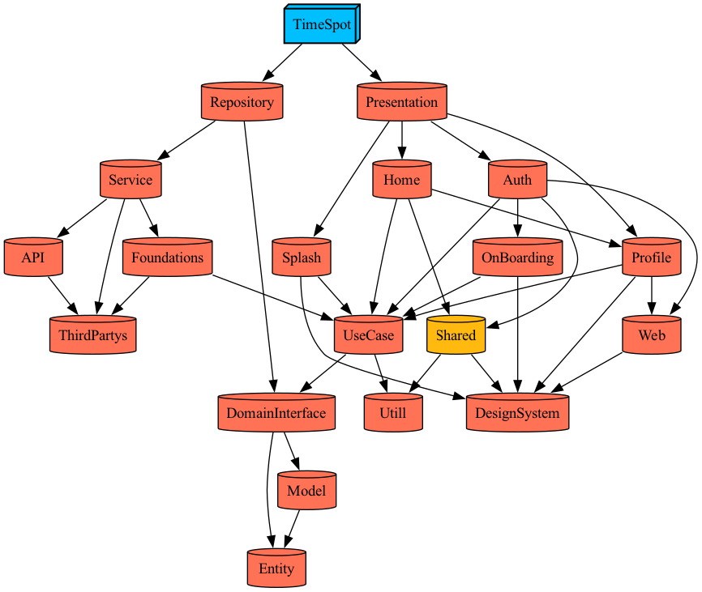

# 노마드 스팟 (NomadSpot)

Tuist로 구성된 멀티 모듈 iOS 프로젝트입니다.

## 🏗️ 프로젝트 구조

```
NomadSpot/
├── Projects/
│   ├── App/                    # 메인 애플리케이션
│   ├── Presentation/           # UI 계층
│   ├── Domain/                 # 도메인 계층
│   │   ├── Entity/             # 도메인 엔티티
│   │   ├── UseCase/            # 비즈니스 로직
│   │   └── DomainInterface/    # 도메인 인터페이스
│   ├── Data/                   # 데이터 계층
│   │   ├── Model/              # 데이터 모델
│   │   ├── Repository/         # Repository 구현체
│   │   ├── API/                # API 클라이언트
│   │   └── Service/            # 데이터 서비스
│   ├── Network/                # 네트워크 계층
│   │   ├── Networks/           # 네트워크 설정
│   │   ├── Foundations/        # 네트워크 유틸리티
│   │   └── ThirdPartys/        # 네트워크 서드파티
│   └── Shared/                 # 공통 모듈
│       ├── DesignSystem/       # 디자인 시스템
│       ├── Shared/             # 공통 모듈
│       └── Utill/              # 유틸리티
├── Tuist/
│   ├── Package.swift
│   └── ProjectDescriptionHelpers/
└── Plugins/
```



## 📦 주요 모듈 설명

- **App**: 메인 애플리케이션 모듈
- **Presentation**: UI 계층 (ViewController, ViewModel)
- **Domain**: 도메인 계층 (Entity, UseCase, Interface)
- **Data**: 데이터 계층 (Model, Repository, API, Service)
- **Network**: 네트워크 계층 (Networks, Foundations, ThirdPartys)
- **Shared**: 공통 모듈 (DesignSystem, Shared, Utill)

## 🚀 빠른 시작

### 프로젝트 생성

```bash
# TuistTool 컴파일 (최초 1회)
swiftc TuistTool.swift -o make

# 새 프로젝트 생성 (대화형)
./make newproject

# 또는 바로 설정
./make newproject MyApp --bundle-id com.company.myapp
```

### 개발 환경 설정

```bash
# Tuist 4.97.2 워크플로우
./make build      # clean → install → generate
./make generate   # 프로젝트 생성
./make clean      # 정리
./make reset      # 전체 캐시 리셋
```

## ⚙️ 개발 환경

- **iOS 17.0+** (Swift Concurrency 완전 지원)
- **Xcode 26.0.1+**
- **Swift 6.0+**
- **Tuist 4.97.2**

## 📚 사용 라이브러리

- **ComposableArchitecture**: 상태 관리
- **TCACoordinators**: TCA 기반 네비게이션
- **WeaveDI**: 의존성 주입
- **Swift Concurrency**: Actor 기반 비동기 처리

## 🎯 주요 특징

### 🏛️ Clean Architecture
```
Presentation → Domain → Data
     ↓           ↓       ↓
   UI 로직   비즈니스   데이터
```

### 🔄 의존성 방향
```
Presentation → Domain (UseCase Protocol)
       ↓
Domain/UseCase → Domain (Repository Protocol)
       ↓
Data/Repository → Domain (Entity + Repository Protocol)
       ↓
Data/Model → Domain (Entity 변환)
```

**핵심 원칙:**
- Presentation은 Domain의 UseCase Protocol만 의존
- Domain은 외부 계층에 의존하지 않는 순수 비즈니스 로직
- Data는 Domain의 Entity와 Repository Protocol을 구현
- 모든 데이터 흐름은 Domain을 중심으로 진행

### 🚀 Swift Concurrency
- Actor 기반 Thread-Safe KeychainManager 구현

### 📦 Tuist 4.97.2 최적화
- ✅ 새로운 `install` 명령어로 빠른 의존성 관리
- ✅ 바이너리 캐시 활용으로 빌드 성능 향상
- ✅ 암시적 의존성 자동 검사

## 🛠️ 주요 명령어

### 기본 워크플로우
```bash
./make build      # 전체 빌드 (권장)
./make generate   # 프로젝트 생성만
./make moduleinit # 새 모듈 생성
```

### 문제 해결
```bash
./make reset      # 강력한 클린 + 재생성
./make install    # 의존성 재설치
```

### 코드 품질
```bash
./make inspect-imports    # 의존성 검사
./make inspect-coverage   # 코드 커버리지
```

